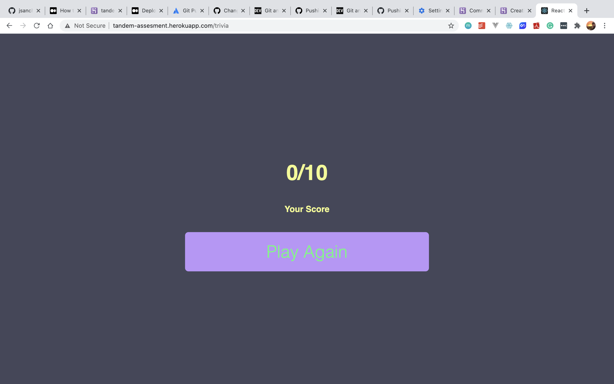

# Tandem 2021 Apprenticeship

# Tandem Code Challenge

## Overview
The goal is to create an application that others will be able to use in order to help improve their trivia skills.
The React application is written using ES9(2019) and hosted via heroku [here](http://tandem-assesment.herokuapp.com/).

## Results




## Installation

To use this framework, be sure to have the following software installed:  

* [Node Package Manager](https://www.npmjs.com/get-npm)
* [Node.js](https://nodejs.org/en/)

To install this package into a project:  

1.  Download cs441_Fall2020_HW01

    ```  
    git clone https://github.com/jsanchez78/TandemAssesment.git
    ```
2. Install the dependencies 

    ```
    npm install
    ```
3. Build the App:

    ```
    npm run 
    ```  


### Future Work


